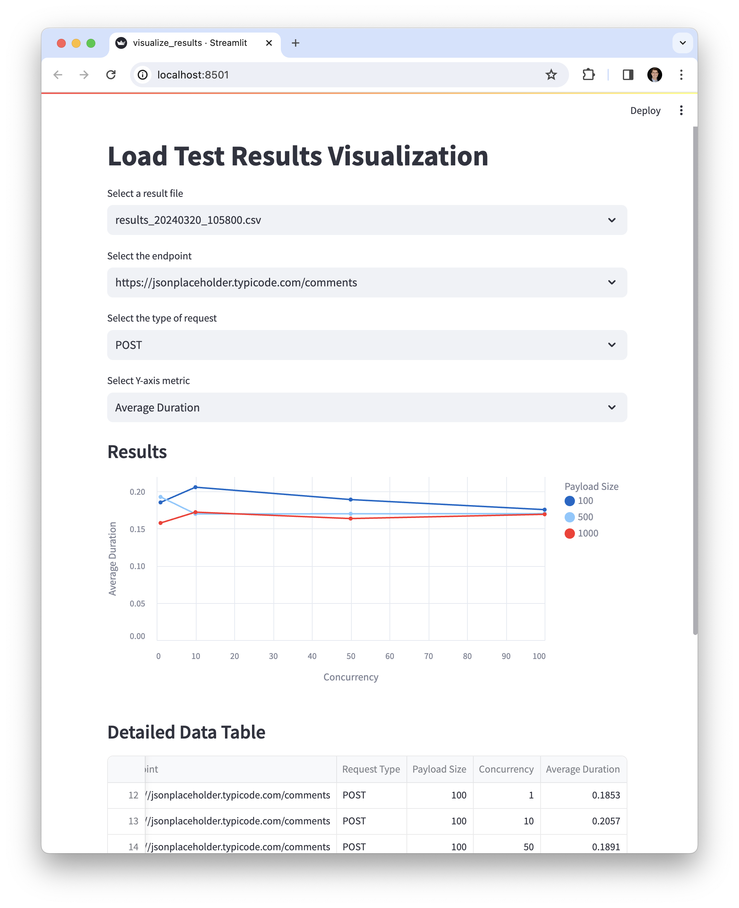

# Overview

`loadtest` is a general-purpose HTTP load-testing and benchmarking library.

Docs can be found here [https://wesslen.github.io/loadtest/](https://wesslen.github.io/loadtest/).

# Setup

You can install the package via `pip`:

```
pip install "loadtest @ git+https://github.com/wesslen/loadtest"
```

For the development, run:

```
$ git clone https://github.com/wesslen/loadtest.git
$ python3.10 -m venv venv
$ source venv/bin/activate
(venv) $ pip install -e .
```

This repo was developed using Python 3.10 and Mac/Unix. It has not yet been tested on different Python versions and OS (e.g., Windows).

# Execute

```
(venv) $ python -m loadtest

python -m loadtest

┏━━━━━━━━━━━━━━━━━━━━━━┳━━━━━━━━━━━━━━━━━━━━━━━━━━━━━━━━━━━━━━━┓
┃ Metric               ┃ Value                                 ┃
┡━━━━━━━━━━━━━━━━━━━━━━╇━━━━━━━━━━━━━━━━━━━━━━━━━━━━━━━━━━━━━━━┩
│ BASE_URL             │ https://jsonplaceholder.typicode.com/ │
│ URL                  │ comments                              │
│ Total Requests       │ 100                                   │
│ Failed Requests      │ 0                                     │
│ Median Latency       │ 0.1623 seconds                        │
│ 75% Latency          │ 0.1676 seconds                        │
│ 95% Latency          │ 0.2029 seconds                        │
│ 99% Latency          │ 0.2076 seconds                        │
└──────────────────────┴───────────────────────────────────────┘

```

Since `loadtest` is a `typer` function, you may use `--help` to provide simple docs:

```
(venv) $ python -m loadtest --help
                                                                                                            
 Usage: python -m loadtest [OPTIONS]                                                                                    
                                                                                                            
 Executes a simple HTTP benchmarking tool that performs a specified number of HTTP requests 
 to a given URL, displays the results including various latency metrics, and handles        
 concurrent requests.                                                                       
                                                                                            
╭─ Options ────────────────────────────────────────────────────────────────────────────────╮
│ --base-url                  TEXT                           The Base URL to benchmark.    │
│                                                            [default:                     │
│                                                            https://jsonplaceholder.typi… │
│ --url                       TEXT                           The URL to benchmark.         │
│                                                            [default: comments]           │
│ --num-requests              INTEGER                        Total number of requests to   │
│                                                            perform.                      │
│                                                            [default: 100]                │
│ --method                    TEXT                           HTTP method to use.           │
│                                                            [default: GET]                │
│ --concurrency               INTEGER                        Number of concurrent          │
│                                                            requests.                     │
│                                                            [default: 1]                  │
│ --install-completion        [bash|zsh|fish|powershell|pws  Install completion for the    │
│                             h]                             specified shell.              │
│                                                            [default: None]               │
│ --show-completion           [bash|zsh|fish|powershell|pws  Show completion for the       │
│                             h]                             specified shell, to copy it   │
│                                                            or customize the              │
│                                                            installation.                 │
│                                                            [default: None]               │
│ --help                                                     Show this message and exit.   │
╰──────────────────────────────────────────────────────────────────────────────────────────╯

```

# Tests

Next, you may modify the load test matrix by modifying the file `loadtest/test_config.json`:

```json
{
    "endpoints": [
      "https://jsonplaceholder.typicode.com/comments",
      "https://jsonplaceholder.typicode.com/todos"
    ],
    "request_types": ["GET", "POST"],
    "payload_sizes": [100, 500, 1000],  
    "concurrency_levels": [1, 10, 50, 100]
  }
```

By default, I'm using these ranges. You would want to adjust these values to reflect realistic scenarios for the application being tested.

I also used `jsonplaceholder`'s default API's as dummy endpoints. You would want to change these to reflect the endpoint you want to test.

```zsh
# from the root
(venv) $ python -m loadtest.run_tests full
Executed 1 GET requests to https://jsonplaceholder.typicode.com/comments with payload size 100 bytes in 0.23 seconds.
Executed 10 GET requests to https://jsonplaceholder.typicode.com/comments with payload size 100 bytes in 1.71 seconds.
...
```

Alternatively, you may run a fractional by running:

```zsh
# from the root
(venv) $ python -m loadtest.run_tests fractional 0.5
Executed 1 GET requests to https://jsonplaceholder.typicode.com/comments with payload size 100 bytes in 0.23 seconds.
Executed 50 GET requests to https://jsonplaceholder.typicode.com/comments with payload size 500 bytes in 8.53 seconds.
...
```

This test will print results to console as well as save results as a `.csv` file in `loadtest/data` with a timestamped named.

```zsh
(venv) $ python -m loadtest.run_tests --help
                                                                                                                                                                      
  Usage: python -m loadtest.run_tests [OPTIONS]                                                                                                  
                                                                                                                                                
 Executes a series of load tests based on configurations defined in a JSON file, allowing for either full or fractional testing. The script     
 generates a test matrix from the configuration, runs the tests as per the matrix, and saves the results to a specified output directory.       
                                                                                                                                                
╭─ Options ────────────────────────────────────────────────────────────────────────────────────────────────────────────────────────────────────╮
│ --config-path               TEXT                             The path to the configuration JSON file. [default: loadtest/test_config.json]   │
│ --data-dir                  TEXT                             The directory where the output results will be saved. [default: loadtest/data]  │
│ --design-type               TEXT                             The design type of the test matrix: 'full' or 'fractional'. [default: full]     │
│ --fraction                  FLOAT                            The fraction of the test matrix to use, required only if design_type is         │
│                                                              'fractional'.                                                                   │
│                                                              [default: None]                                                                 │
│ --install-completion        [bash|zsh|fish|powershell|pwsh]  Install completion for the specified shell. [default: None]                     │
│ --show-completion           [bash|zsh|fish|powershell|pwsh]  Show completion for the specified shell, to copy it or customize the            │
│                                                              installation.                                                                   │
│                                                              [default: None]                                                                 │
│ --help                                                       Show this message and exit.                                                     │
╰──────────────────────────────────────────────────────────────────────────────────────────────────────────────────────────────────────────────╯

```

# Visualizing Tests

You may run a streamlit app to visualize the results by running:

```
(venv) $ python -m streamlit run loadtest/visualize_results.py
```



Within the app, you can select options based on:

1. the file (timestamp of the run)
2. endpoint
3. type of request: `GET` vs. `POST`
4. y axis metric: `Duration` (in seconds) or `Failures`